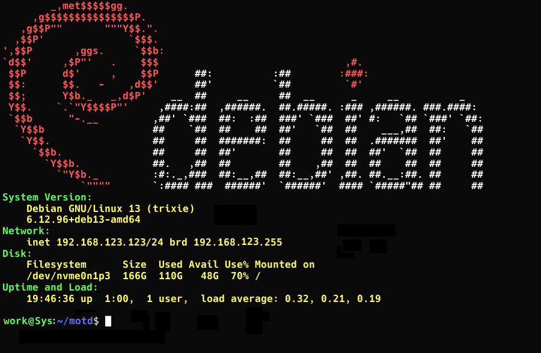

# Terminal Login MOTD Customization

The motd script can print useful information on login, about your computers status 
-- such as current IP and operating system and Kernel version, Disk space, service 
status, running Docker containers and fancy ASCII logo.

## Automatic setup (recommended)

### Run the `setup.sh` script

The setup script
- automatically copies the files to the correct location on disk. 
    - `~/motd/motd.sh`
    - `/etc/motd-script/motd.sh`
- adds the script to appropriate startup script
    - `~/.bashrc` for local user or
    - `/etc/profile` for system wide instal

### Customize the script (Optional)

Depending on whether you chose local user or system wide instal, the script is located 
in either of the following locations:

- `~/motd/motd.sh`
- `/etc/motd-script/motd.sh`

- You can reorder the components in the script according to your preference. 
- You can comment out the modules you don't need and anable the ones you want.

#### Banners and titles

The script can use the `linuxlogo` command to print out a distribution specific logo, 
if enabled int the script. Using it requires enabling it in script and installing the 
`linuxlogo` program through `apt` or your app repository.

### Removing the script

To remove the script

Remove files in
- `~/motd/motd.sh` (local user)
- `/etc/motd-script/motd.sh` (system wide)

and remove the line starting the `motd.sh` script at the end of the appropriate start 
script.
- `~/.bashrc` (local user)
- `/etc/profile` (system wide)
