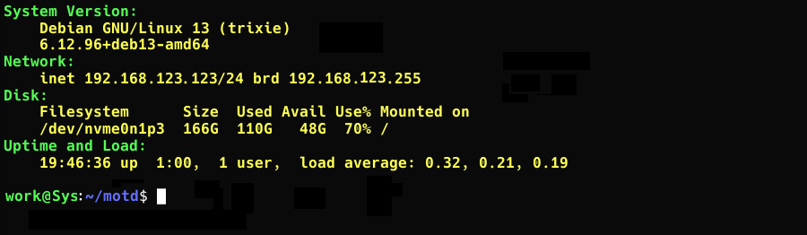

# Terminal Login MOTD Customization

The motd script can print useful information on login about your computers status 
-- such as current IP, operating system, Kernel version, Disk space, service 
status, running Docker containers, and a fancy ASCII logo, if you so choose.



## Setup (for local user) (recommended)

Clone the repository and add the script to `.bashrc`:

```
git clone https://github.com/JValtteri/soc-calc.git
echo "~/motd/motd.sh" >> ~/.bashrc
```

## Setup (system wide) (*broken*)

**Current setup script for system wide install is unreliable. If you are somewhat 
tech savvy, see `setup.sh` script and you'll likely understand what needs to be done.**

```
git clone https://github.com/JValtteri/soc-calc.git
cd motd
./setup.sh
```

### Customize the script (Optional)

Depending on whether you chose local user or system wide instal, the script is located 
in either of the following locations:

- `~/motd/motd.sh`
- `/etc/motd-script/motd.sh`


- You can reorder the components in the script according to your preference. 
- You can comment out the modules you don't need and anable the ones you want.

#### Banners and titles

##### `linuxlogo`

The script can use the `linuxlogo` command to print out a distribution specific logo, 
if enabled int the script. Using it requires enabling it in script and installing the 
`linuxlogo` program through `apt` or your app repository.

##### `figlet`

You may use `figlet` to create custom ASCII-art banner texts. This requires 
installing `figlet` separately. It's available through your distributions app repository.

##### Pre-made static banners

The script includes pre-made banners in `motd/modules/banners/` directory. You may 
enable one by un-commenting the appropriate line and adding the correct script name. 
See the directory for available banner scripts. 

You may make your own banners too. The pre-made banners were created using 
text-to-ascii generator at: https://www.asciiart.eu/text-to-ascii-art

### Removing the script

To remove the script

Remove files in
- `~/motd/motd.sh` (local user)
- `/etc/motd-script/motd.sh` (system wide)

and remove the line starting the `motd.sh` script at the end of the appropriate start 
script.
- `~/.bashrc` (local user)
- `/etc/profile` (system wide)
